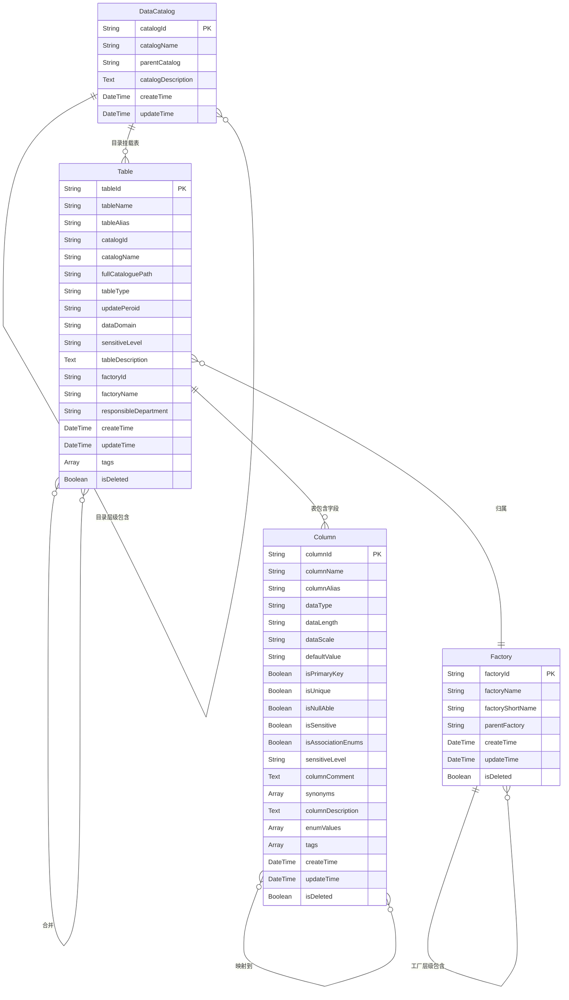

# 元数据关系图谱

## 关系属性说明

### 目录层级包含
- relationId（唯一）：关系全局唯一标识
- createTime：关系创建时间
- updateTime：关系最后更新时间
- isDeleted：删除状态（默认false）

### 目录挂载表
- relationId（唯一）：关系全局唯一标识
- createTime：关系创建时间
- updateTime：关系最后更新时间
- isDeleted：删除状态（默认false）

### 表包含字段
- relationId（唯一）：关系全局唯一标识
- columnOrder：字段在表中的物理顺序
- createTime：关系创建时间
- updateTime：关系最后更新时间
- isDeleted：删除状态（默认false）

### 表依赖于
- relationId（唯一）：关系全局唯一标识
- dependencyType：依赖类型（强/弱）
- createTime：关系创建时间
- updateTime：关系最后更新时间
- isDeleted：删除状态（默认false）

### 字段映射到
- relationId（唯一）：关系全局唯一标识
- mappingType：映射类型（一对一/一对多/多对一/多对多）
- createTime：关系创建时间
- updateTime：关系最后更新时间
- isDeleted：删除状态（默认false）

### 工厂层级包含
- relationId（唯一）：关系全局唯一标识
- createTime：关系创建时间
- updateTime：关系最后更新时间
- isDeleted：删除状态（默认false）

### 表归属
- relationId（唯一）：关系全局唯一标识
- createTime：关系创建时间
- updateTime：关系最后更新时间
- isDeleted：删除状态（默认false）

### 表关联查询
- relationId（唯一）：关系全局唯一标识
- joinType：关联类型（内连接/左连接等）
- joinCondition：关联条件
- createTime：关系创建时间
- updateTime：关系最后更新时间
- isDeleted：删除状态（默认false）

### 表合并
- relationId（唯一）：关系全局唯一标识
- unionType：合并类型（union/union all）
- fieldMatch：字段匹配规则
- createTime：关系创建时间
- updateTime：关系最后更新时间
- isDeleted：删除状态（默认false）
